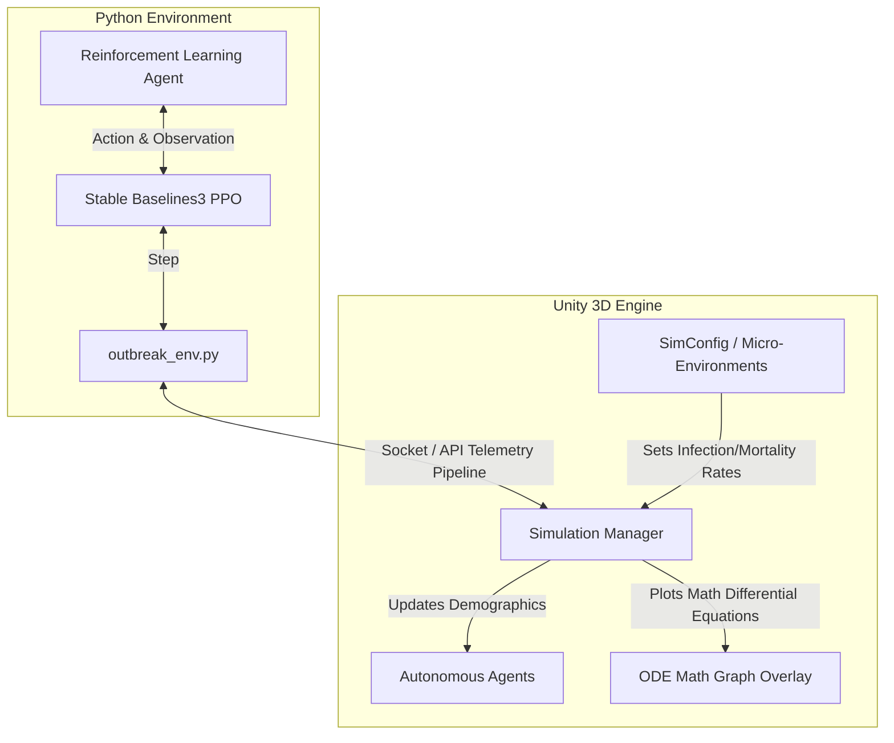
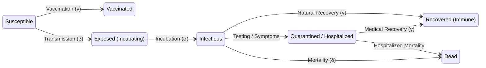

# Project-Aegis-Adaptive-Outbreak-Containment-
Project Aegis: Adaptive outbreak containment for #ROVOTINKERQUEST. Employs Hierarchical Reinforcement Learning (PPO/DQN) to optimize resource allocation under real-world constraints. Features an agent-based SEIR simulation and Atlassian Rovo integration for real-time decision-making and clear epidemiological insights.
[README.md](https://github.com/user-attachments/files/26418861/README.md)

# 🦠 Adaptive Outbreak Containment
**An Interactive 3D Epidemic Simulation & AI Decision Engine**

 
 

  <em>Deciding how to intervene effectively under real-world constraints—when every second counts.</em>

---

## 📖 Table of Contents
- [Problem Statement](#-problem-statement)
- [Expected Outcome](#-expected-outcome)
- [About the Project](#-about-the-project)
- [System Architecture](#-system-architecture)
- [Disease Model (SEIR-DV)](#-disease-model-seir-dv)
- [Development Milestones](#-development-milestones)
- [Tech Stack](#-tech-stack)
- [How to Run](#-how-to-run)
- [What's Next?](#-whats-next)

---

## 📌 Problem Statement

In infectious disease outbreaks, the primary challenge is not merely predicting how a disease spreads, but **deciding how to intervene effectively under real-world constraints**. Public health systems must operate with **limited vaccines, constrained hospital capacity, delayed and incomplete data, and varying levels of public compliance**.

Current tools largely focus on static modeling or post-hoc analysis, offering limited support for **dynamic, real-time decision-making** in evolving scenarios.

This problem requires the development of a system that simulates a population as an **interactive, evolving environment**, where:
- Individuals interact through a structured network of contacts.
- Disease transmission emerges from these interactions over time.
- Behavioral factors such as mobility and compliance influence outcomes.
- A central decision-making entity allocates limited resources (e.g., vaccines, testing, restrictions).

The objective is to design an **adaptive decision engine** capable of continuously observing partial and imperfect outbreak data, making intervention decisions under uncertainty and constraints, and minimizing infection spread, fatalities, and system overload.

---

## 🎯 About the Project

### ❓ What are we building?
An interactive, 3D agent-based epidemic simulation engine. It models the spread of a pathogen across a diverse population. A central decision-making entity (either a human player or a Reinforcement Learning agent) must deploy limited resources—like vaccines, quarantines, and social distancing mandates—to prevent systemic collapse.

### 💡 Why are we building it?
Static models fall short during live, evolving crises. We need tools that treat outbreak management as a **dynamic control problem**, allowing policy-makers to test and compare intervention strategies interactively and observe downstream emergent behaviors *before* real human lives are at stake.

### ⚙️ How are we building it?
We leverage **Unity (URP)** for high-performance 3D visualization and mathematical tracking, combined with a **Python Reinforcement Learning** backend that trains an AI "Governor" to learn optimal paths for deploying limited interventions under shifting constraints.

---

## 🏗️ System Architecture

Our project is split into two interconnected layers: a high-performance 3D Unity Simulation Engine, and an external Python Reinforcement Learning brain.

---

## 🦠 Disease Model (SEIR-DV)

Our engine utilizes an extended Susceptible-Exposed-Infectious-Recovered (SEIR) continuous time model. This compartmental approach is augmented to include states for hospitalization, intensive care, death (D), as well as a "Vaccinated" (V) status that confers protection.

**Demographic Modifiers**: Not all agents are equal. The system generates populations with varied ages and genders. Seniors (65+) face a heavily multiplied mortality risk ($$2.5x$$), while children act as highly susceptible latency vectors.

---

## 🛠️ Development Milestones

### Milestone 1: Architecting the Underlying SEIR-DV Mathematics & Telemetry
- **The Problem:** We struggled with visualizing the predicted mathematical spread directly in the Unity UI. Modern rendering pipelines completely bypassed our legacy graphing hooks.
- **The Solution:** We completely rewrote the mathematical plotting system to generate a dense 2D Texture on the CPU via pixel-buffer manipulation (`ODEGraph.cs`). This ensured a completely stable UI rendering system across any graphics pipeline and allowed us to draw stacked, semi-transparent area charts of the equations dynamically!

### Milestone 2: Injecting Age, Gender & Vulnerability 
- **The Problem:** Early tests showed the entire population acting as a monolith. The virus either fizzled out instantly or infected everyone immediately.
- **The Solution:** We overhauled `HealthState.cs` to ingest demographic modifiers. We mathematically tied the transmission rate ($$\beta$$) and mortality rate ($$\delta$$) to these groups. Seniors get impacted exponentially harder, while kids act as highly susceptible vectors.

### Milestone 3: Visual Clarity & Spatial Arrangement
- **The Problem:** Initially, the city grid generated massive, dense arrays of physical skyscrapers that obscured the agents, making it chaotic to debug transmission waves.
- **The Solution:** We restricted physical building generation strictly to the perimeter of the field, clearing out a spacious "central plateau" for observation. We further reworked shader colors mapping to the disease states (e.g., Susceptible is neon green, Infectious is pure red, Dead is pitch black), ensuring outbreaks are visually distinct the absolute second they emerge.

---

## 💻 Tech Stack

- **Game Engine:** Unity 6 (Universal Render Pipeline)
- **Programming Languages:** C# and Python
- **AI / Machine Learning:** Stable Baselines3 (PPO), OpenAI Gym / Gymnasium
- **Math Modeling:** Numerical ODE Integration (Euler's Method)

---

## 🚀 How to Run

### Running the Unity Simulation
1. Clone this repository.
2. Open the project inside **Unity Hub**.
3. Navigate to `Assets/Scenes` and open the Main Scene.
4. Hit **Play** to watch the autonomous simulated spread immediately generate data on the ODE UI Graph.

### Training the AI Governor
1. Navigate to the `python/` directory.
2. Install dependencies: `pip install -r requirements.txt`
3. Run the training script: `python train_governor.py`
4. The Python environment will establish a connection with the running Unity simulation and begin taking actions (Vaccinate, Lockdown) over thousands of episodes to minimize the outbreak!

---

## 🔮 What's Next?
- **Graph Neural Networks (GNNs):** Rather than modeling contacts purely by physical proximity, we plan to implement a GNN backend to model familial and workspace topologies.
- **Waning Immunity:** Introducing a temporal decay to the Recovered and Vaccinated states to simulate seasonal re-infections.
- **Extended Hospital Logistics:** Constraining actual physical beds and tracking intensive care utilization independently of general quarantine protocols.
